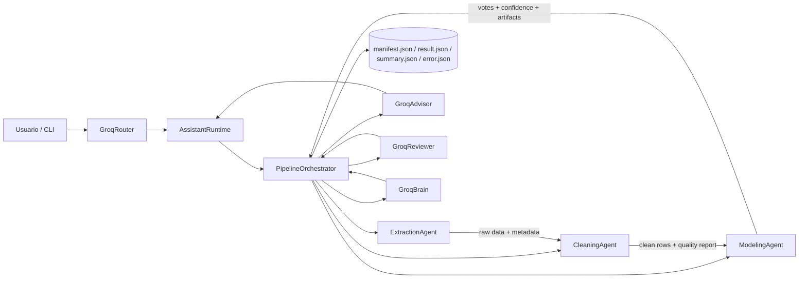

# IAC MoneyLab - Pipeline Cuantitativo Multiagente

Para usar la parte final de operación/adaptive

.venv/bin/python scripts/review_adaptive.py --artifact-root artifacts --run-id run_0001 --reviewer ops-lead --decision approve --notes "manual signoff" --json
.venv/bin/python scripts/apply_adaptive.py --artifact-root artifacts --run-id run_0001 --operator release-operator --notes "prepare package" --json
.venv/bin/python scripts/promote_adaptive.py --artifact-root artifacts --run-id run_0001 --operator prod-operator --notes "apply package" --json
.venv/bin/python scripts/ops_schedule.py set --artifact-root artifacts --run-id run_0001 --interval-seconds 300 --start-immediately --json
.venv/bin/python scripts/ops_schedule.py run --artifact-root artifacts --run-id run_0001 --json
.venv/bin/python scripts/ops_automation.py --artifact-root artifacts --run-id run_0001 --json
Para operación general

.venv/bin/python scripts/verify_run.py --artifact-root artifacts --run-id run_0001 --json
.venv/bin/python scripts/observability_report.py --artifact-root artifacts --run-id run_0001 --json
.venv/bin/python scripts/readyz.py --artifact-root artifacts --json
.venv/bin/python scripts/release_gate.py --artifact-root artifacts --json
.venv/bin/python scripts/release_board.py --artifact-root artifacts --limit 10 --json
.venv/bin/python scripts/ops_dashboard.py --artifact-root artifacts --run-id run_0001 --persist --json
.venv/bin/python scripts/ops_refresh.py --artifact-root artifacts --run-id run_0001 --json
.venv/bin/python scripts/ops_runner.py --artifact-root artifacts --run-id run_0001 --cycles 3 --interval-seconds 0 --json
.venv/bin/python scripts/soak_gate.py --artifact-root artifacts --run-id run_0001 --required-hours 72 --json


## Artefactos estructurados del asistente

El asistente no razona sobre logs sueltos. Razona sobre artefactos estructurados por corrida.

- `result.json` guarda el resultado completo y trazable de la ejecución.
- `summary.json` guarda el resumen normalizado que el asistente usa para explicar la corrida en lenguaje natural.
- `error.json` guarda el contexto de fallo sin depender de la traza cruda.

Flujo real en el código:

- El orquestador ejecuta los agentes y escribe `manifest.json`, `result.json`, `summary.json` y, si hay fallo, `error.json`.
- El runtime carga ese bundle desde disco y lo usa como contexto de conversación.
- `GroqAdvisor` recibe diccionarios estructurados derivados de esos artefactos para reescribir briefs y respuestas.
- El asistente trabaja sobre esa información, no sobre logs sin estructura.

En la práctica, el asistente razona así:

- primero `extraction` produce datos crudos
- luego `cleaning` produce datos limpios y métricas
- luego `modeling` produce votos, confianza y decisión
- luego `orchestrator` consolida todo
- si hay error, el panel sale desde `error.json` con la etapa exacta que falló

## Resumen ejecutivo
Este repositorio implementa un ecosistema multiagente para research cuantitativo sobre `yfinance`. La solución separa de forma clara la extracción, la limpieza/estandarización y el modelado, con una capa de orquestación y una interfaz conversacional que permite consultar el sistema en lenguaje natural.

El objetivo no es solo predecir una señal. El objetivo es demostrar una arquitectura reproducible, trazable y fácil de explicar para evaluación técnica y de negocio.

## Qué resuelve

- Extrae datos de mercado desde `yfinance`.
- Limpia y estandariza el esquema.
- Entrena y evalúa tres modelos locales.
- Registra artefactos reproducibles por corrida.
- Permite comparación opcional con Binance.
- Permite un modo experimental con `--groq-brain`.
- Expone todo desde CLI y desde el asistente conversacional.

## Arquitectura

| Componente | Rol |
| --- | --- |
| `ExtractionAgent` | Consume `yfinance`, valida entradas y genera la capa raw trazable. |
| `CleaningAgent` | Normaliza fechas, tipos, nulos y reglas de calidad. |
| `ModelingAgent` | Entrena tres modelos locales y produce la señal final. |
| `PipelineOrchestrator` | Coordina el flujo, consolida la verdad y escribe artefactos. |
| `GroqRouter` | Interpreta lenguaje natural y enruta la intención correcta. |
| `GroqAdvisor` | Redacta briefs cortos por etapa cuando Groq está disponible. |
| `GroqReviewer` | Puede revisar o confirmar la decisión final. |
| `GroqBrain` | Modo experimental que puede tomar la decisión final. |

### Flujo

`Extracción -> Limpieza -> Modelado -> Orquestador`

La conversación del asistente sigue ese mismo recorrido. Cada etapa devuelve el mismo `run_id` y la misma trazabilidad de artefactos.

### Mapa de arquitectura




### Árbol de arquitectura

```text
IACTEST/
├── README.md                      # documentación principal y guía de entrega
├── requirements.txt               # dependencias fijadas para reproducir el entorno
├── .env                           # variables locales opcionales, por ejemplo Groq
├── assistant/                     # capa conversacional, semántica y grounding híbrido
│   ├── router.py                  # interpreta intención, run_id, etapa, modo y foco semántico
│   ├── runtime.py                 # carga bundles de corrida, responde al chat y mezcla local/web
│   ├── context.py                 # memoria de sesión, follow-ups y resolución de referencias
│   ├── contracts.py               # contratos de ruta, sesión, contexto y estado conversacional
│   ├── domain.py                  # glosario local, comparaciones y conceptos financieros
│   ├── grounding.py               # paquete de grounding local/web para respuestas trazables
│   ├── planner.py                 # planner estructurado del control plane
│   ├── policy.py                  # límites y validación de tools/riesgo
│   ├── source_selector.py         # decide local / mixed / web según la query
│   ├── web.py                     # retriever web, presets de proveedor y probe de estado
│   ├── scorecard.py               # scorecard de madurez y runtime-ready del assistant
│   ├── executor.py                # ejecución controlada del plan
│   ├── tools.py                   # tools internas del assistant
│   └── state.py                   # persistencia del estado entre mensajes
├── pipeline/                      # orquestación del flujo cuantitativo
│   └── orchestrator.py            # ejecuta etapas y escribe manifest/result/summary/error
├── agents/                        # trabajo técnico por etapa
│   ├── extraction_agent.py        # baja datos crudos desde yfinance
│   ├── cleaning_agent.py         # limpia, valida y genera features
│   └── modeling_agent.py          # entrena modelos y produce el candidato local
├── adaptive/                      # capa adaptativa cuantitativa gobernada
│   ├── drift.py                   # detecta drift y cambio de régimen
│   ├── selector.py                # propone estrategia/modelo recomendado
│   ├── shadow.py                  # benchmark paralelo sin afectar producción
│   ├── policy.py                  # aprueba o bloquea cambios adaptativos
│   ├── validator.py               # valida candidato vs baseline
│   ├── gate.py                    # promotion gate adaptativo
│   ├── promote.py                 # marca un paquete preparado como aplicado
│   ├── registry.py                # versiona features observadas/aprobadas
│   ├── scheduler.py               # sugiere reentrenamiento
│   └── fingerprint.py             # huella reproducible del runtime
├── ops/                           # control operativo, health y release gates
│   ├── reports.py                 # observability, verify y release summary
│   ├── health.py                  # readyz, release gate y release board
│   ├── refresh.py                 # materializa snapshots operativos de un run
│   ├── soak.py                    # soak gate persistido desde ventana observada
│   ├── job_runner.py              # runner periódico para refresh/soak operativos
│   ├── scheduler.py               # scheduler persistido para ejecutar jobs cuando estén due
│   └── automation.py              # genera cron/systemd/script para ejecutar el schedule
├── providers/                     # capa Groq
│   ├── groq_advisor.py            # reescribe briefs y respuestas
│   ├── groq_reviewer.py           # revisa y puede desempatar la decisión
│   ├── groq_brain.py              # modo experimental que puede decidir
│   └── groq_payloads.py           # compacta el contexto estructurado
├── schemas/                       # contratos de datos del pipeline
│   ├── pipeline.py                # request, manifest, result, adaptive y ops
│   └── planner.py                 # AssistantPlan y PlannerStep
├── scripts/                       # comandos de ejecución
│   ├── assistant_chat.py          # chat interactivo
│   ├── assistant_scorecard.py     # scorecard conversacional o JSON del assistant
│   ├── assistant_web_probe.py     # probe y setup guiado del retriever web
│   ├── run_pipeline.py            # ejecución batch del pipeline
│   ├── compare_sources.py         # comparación yfinance vs Binance
│   ├── verify_run.py              # validación estructurada de un run
│   ├── observability_report.py    # métricas operativas por run
│   ├── readyz.py                  # readiness operativo desde artifacts
│   ├── release_gate.py            # gate de release desde artifacts
│   ├── release_board.py           # tablero de runs recientes
│   ├── soak_gate.py               # materializa soak y release sobre runs
│   ├── review_adaptive.py         # persiste aprobación manual de candidatos adaptativos
│   ├── apply_adaptive.py          # empaqueta config versionada tras aprobación manual
│   ├── promote_adaptive.py        # marca la promoción como aplicada
│   ├── ops_refresh.py             # recalcula y persiste el bundle operativo completo
│   ├── ops_dashboard.py           # materializa tablero operativo JSON/HTML
│   ├── ops_runner.py              # ejecuta ciclos periódicos de refresh operativo
│   ├── ops_schedule.py            # persiste y ejecuta schedules operativos due
│   └── ops_automation.py          # materializa artifacts de cron/systemd para el schedule
├── utils/                         # utilidades compartidas
│   ├── data_processing.py         # helpers de limpieza y preparación
│   ├── legacy_btc.py              # puente legacy BTC/ETH/LTC
│   └── ml_models.py               # utilidades de modelos
├── tests/                         # cobertura de router, runtime y pipeline
│   ├── test_assistant_router.py
│   ├── test_assistant_runtime.py
│   ├── test_assistant_planner.py
│   ├── test_assistant_executor.py
│   ├── test_extraction.py
│   ├── test_cleaning_modeling.py
│   ├── test_legacy_bridge.py
│   ├── test_orchestrator.py
│   ├── test_verify_run.py
│   ├── test_ops_health.py
│   ├── test_adaptive_policy.py
│   ├── test_adaptive_review.py
│   ├── test_adaptive_apply.py
│   ├── test_adaptive_promote.py
│   ├── test_ops_refresh.py
│   ├── test_soak_gate.py
│   ├── test_ops_dashboard.py
│   ├── test_ops_runner.py
│   ├── test_ops_schedule.py
│   ├── test_ops_automation.py
│   └── test_release_lifecycle.py
├── docs/                          # nota técnica, ejecutiva y evidencia
│   ├── TECH_NOTE.md
│   ├── NOTA_EJECUTIVA.md
│   └── claude_code_evidence.md
├── main.py                        # API FastAPI para pipeline, assistant y ops
└── artifacts/                     # evidencia persistida por corrida
    ├── assistant/                 # estado por sesión
    └── runs/
        └── run_XXXX/              # bundle de una corrida
            ├── manifest.json      # request y flags de la corrida
            ├── summary.json       # lectura normalizada para el asistente
            ├── result.json        # resultado completo y estructurado
            ├── logs.json          # logs estructurados
            ├── error.json         # solo si falla
            ├── adaptive/          # drift, approval, review manual, config versionada, shadow, retraining y fingerprint
            ├── ops/               # observability, verify, dashboard, soak y release
            ├── raw/               # datos crudos extraídos
            ├── cleaned/           # datos limpios y reporte de calidad
            └── models/            # modelos entrenados y resumen
```


#### Skills y módulos

- `extract`: obtiene la materia prima desde `yfinance`.
- `clean`: normaliza fechas, tipos, nulos y controles de calidad.
- `model`: produce votos, confianza y decisión cuantitativa.
- `orchestrate`: consolida la verdad de la corrida y publica artefactos.
- `advise`: convierte el resultado estructurado en explicaciones cortas.
- `review`: permite una segunda lectura opcional.
- `brain`: experimento de decisión final guiada por Groq.

#### Módulos reutilizables 

- `assistant/`: router, runtime, contexto, dominio semántico, grounding híbrido, scorecard y retriever web.
- `pipeline/`: orquestación y persistencia de artefactos.
- `agents/`: extracción, limpieza y modelado.
- `providers/`: GroqRouter, GroqAdvisor, GroqReviewer y GroqBrain.
- `scripts/`: CLI conversacional, scorecard, probe web, runner y comparación de fuentes.

#### Contratos de comunicación

- `AssistantRoute`: intención, tickers, fechas, modo y etapa.
- `AssistantState`: contexto persistente de la sesión.
- `RunManifest`: registro vivo de logs y estado de ejecución.
- `PipelineResult`: salida estructurada de la corrida.
- `ErrorPayload`: contexto estructurado cuando una etapa falla.

#### Cómo se comunican

1. El router interpreta la intención del usuario.
2. El runtime carga el contexto del último run y decide el handler.
3. El orquestador ejecuta extracción, limpieza y modelado.
4. Cada etapa deja artefactos con el mismo `run_id`.
5. GroqAdvisor, GroqReviewer y GroqBrain consumen el contexto estructurado, no texto suelto.

## Nota de negocio

La forma de explicarlo a nivel de negocio es esta:

> El sistema convierte datos de mercado en una decisión auditada, repetible y fácil de revisar.

Eso significa que el valor no está solo en la predicción, sino en:

- la separación de responsabilidades,
- la trazabilidad de cada paso,
- la capacidad de explicar por qué se tomó una decisión,
- y la posibilidad de comparar una ruta local determinista con una ruta experimental basada en Groq.

Para un negocio, esto permite:

- reducir dependencia de scripts sueltos,
- estandarizar el research,
- auditar por qué una señal fue `long`, `short` o `hold`,
- y mostrar una arquitectura lista para crecer a entornos más reales.

Si necesitas una versión más corta para entregar a stakeholders, usa [docs/NOTA_EJECUTIVA.md](docs/NOTA_EJECUTIVA.md).

### Cómo se ve la historia de negocio

- `ExtractionAgent` responde: qué activo, qué rango, qué faltó.
- `CleaningAgent` responde: qué quedó limpio, qué métricas existen y qué fila exacta se puede analizar.
- `ModelingAgent` responde: qué votó cada modelo y con qué confianza.
- `PipelineOrchestrator` responde: cuál es la decisión final y por qué.
- `GroqAdvisor` y `GroqReviewer` convierten ese flujo en un resumen entendible por un usuario no técnico.

## Nota ejecutiva

Este proyecto muestra una plataforma cuantitativa multiagente que convierte datos de mercado en una decisión explicable, trazable y reproducible. Su valor no está solo en generar una señal, sino en convertir ese proceso en una historia clara para negocio, auditoría y evaluación técnica.

### Propuesta de valor

- Reduce trabajo manual de revisión y comparación de datos.
- Estandariza el research con un flujo repetible.
- Explica por qué una corrida termina en `long`, `short` o `hold`.
- Permite revisar cada etapa sin perder trazabilidad.

### Cómo funciona

1. El usuario pide un análisis desde CLI o en lenguaje natural.
2. El router interpreta la intención y la dirige al agente correcto.
3. El flujo pasa por extracción, limpieza, modelado y orquestación.
4. La salida final incluye decisión, confianza y evidencia por corrida.
5. Un ticker suelto como `AAPL`, `MSFT`, `BTC-USD` o `EURUSD=X` lanza una corrida por defecto.
6. Un nombre de agente suelto como `Extracción`, `Limpieza`, `Modelado` u `Orquestador` abre esa vista.
7. Un modo suelto como `modos`, `local_only` o `compare-binance` abre la guía de modos.

### Roles clave

| Componente | Función de negocio |
| --- | --- |
| `ExtractionAgent` | Captura el activo, el rango y la materia prima del análisis. |
| `CleaningAgent` | Normaliza los datos y reduce ruido operativo. |
| `ModelingAgent` | Convierte el histórico limpio en una señal cuantitativa. |
| `PipelineOrchestrator` | Consolida la decisión final y deja evidencia. |
| `GroqAdvisor` | Mejora la lectura ejecutiva de cada etapa cuando Groq está disponible. |
| `GroqReviewer` | Agrega una segunda lectura opcional para revisión. |
| `GroqBrain` | Permite experimentar con una decisión final gobernada por Groq. |

### Impacto para stakeholders

Este enfoque ayuda a:

- demostrar control sobre el proceso,
- reducir dependencia de scripts aislados,
- comparar una ruta local determinista con una ruta experimental,
- y presentar resultados con una narrativa fácil de explicar.

### Qué se entrega

- una interfaz conversacional para consultar el sistema,
- una ruta reproducible de datos y modelos,
- evidencia por corrida,
- documentación en español,
- y un mapa claro de arquitectura, roles y modos.

### Mensaje final

No es solo un modelo. Es un proceso de decisión cuantitativa con trazabilidad, lectura ejecutiva y espacio para crecer hacia despliegues más completos.

## Nota técnica

La solución se organiza en cuatro capas:

1. `assistant/`: interpreta lenguaje natural y administra la sesión.
2. `pipeline/`: ejecuta la corrida y escribe artefactos.
3. `agents/`: extracción, limpieza y modelado.
4. `providers/`: GroqRouter, GroqAdvisor, GroqReviewer y GroqBrain.

### Flujo de datos

`yfinance -> raw data -> cleaning -> feature engineering -> modeling -> artifacts -> assistant`

La misma corrida se conserva con un `run_id` compartido para poder rastrear:

- entrada,
- limpieza,
- métricas,
- decisión final,
- y mensajes del asistente.

### Integración con Groq

Groq se usa en tres puntos:

- enrutamiento de lenguaje natural,
- briefs de etapa,
- y revisión o brain experimental.

Si Groq no responde, el sistema cae al texto local sin romper la corrida.

### Reproducibilidad

Cada corrida guarda:

- `manifest.json`
- `summary.json`
- `result.json`
- `logs.json`
- `adaptive/*.json`
- `ops/*.json`
- CSVs crudos y limpios
- modelos entrenados

Eso permite repetir la experiencia y auditarla después.

### Operación real

La solución ya tiene una capa operativa basada en artifacts persistidos:

- `verify_run`: valida el bundle completo de una corrida.
- `observability_report`: lee métricas operativas reales del run.
- `readyz`: indica si el sistema está listo desde el último run persistido.
- `release_gate`: endurece el release con checks operativos y de observabilidad.
- `release_board`: resume los runs recientes.
- `ops_dashboard`: consolida readyz, release, verify y observabilidad en JSON/HTML persistido.
- `review_adaptive`: registra la decisión humana sobre un candidato adaptativo elegible.
- `apply_adaptive`: prepara una configuración candidata versionada después del signoff humano.
- `promote_adaptive`: cierra el ciclo y deja trazado el estado `applied`.
- `ops_refresh`: recalcula y persiste `readyz`, `release_gate`, `release_board`, `dashboard` y `soak`.
- `ops_runner`: ejecuta ciclos periódicos de `ops_refresh` y deja un artifact de job trazable.
- `ops_schedule`: persiste una planificación operativa y la ejecuta solo cuando está due.
- `ops_automation`: materializa script, cron y systemd timer/service para ejecutar el schedule fuera de la app.
- `soak_gate`: materializa una ventana de soak sobre runs persistidos.

Estados de `release_gate`:

- `blocked`: faltan garantías operativas o adaptativas.
- `pending_soak`: verify está verde, pero falta ventana de soak.
- `pending_apply`: el candidato pasó release, pero el paquete adaptativo sigue en `prepared`.
- `release_ready`: release verde sin aplicación adaptativa pendiente.
- `release_applied`: release verde y el paquete adaptativo ya quedó marcado como `applied`.

Comandos:

```bash
.venv/bin/python scripts/verify_run.py --artifact-root artifacts --run-id run_0001 --json
.venv/bin/python scripts/observability_report.py --artifact-root artifacts --run-id run_0001 --json
.venv/bin/python scripts/readyz.py --artifact-root artifacts --json
.venv/bin/python scripts/release_gate.py --artifact-root artifacts --json
.venv/bin/python scripts/release_board.py --artifact-root artifacts --limit 10 --json
.venv/bin/python scripts/ops_dashboard.py --artifact-root artifacts --run-id run_0001 --persist --json
.venv/bin/python scripts/review_adaptive.py --artifact-root artifacts --run-id run_0001 --reviewer ops-lead --decision approve --notes "manual signoff" --json
.venv/bin/python scripts/apply_adaptive.py --artifact-root artifacts --run-id run_0001 --operator release-operator --notes "prepare package" --json
.venv/bin/python scripts/promote_adaptive.py --artifact-root artifacts --run-id run_0001 --operator prod-operator --notes "apply package" --json
.venv/bin/python scripts/ops_refresh.py --artifact-root artifacts --run-id run_0001 --json
.venv/bin/python scripts/ops_runner.py --artifact-root artifacts --run-id run_0001 --cycles 3 --interval-seconds 0 --json
.venv/bin/python scripts/ops_schedule.py set --artifact-root artifacts --run-id run_0001 --interval-seconds 300 --start-immediately --json
.venv/bin/python scripts/ops_schedule.py run --artifact-root artifacts --run-id run_0001 --json
.venv/bin/python scripts/ops_automation.py --artifact-root artifacts --run-id run_0001 --json
.venv/bin/python scripts/soak_gate.py --artifact-root artifacts --run-id run_0001 --required-hours 72 --json
```

Endpoints:

- `GET /health`
- `GET /readyz`
- `GET /releasez`
- `GET /release-board`
- `GET /ops/dashboard`
- `GET /ops/dashboard/html`
- `GET /pipeline/runs/{run_id}/verify`
- `GET /pipeline/runs/{run_id}/observability`
- `POST /pipeline/runs/{run_id}/dashboard`
- `POST /pipeline/runs/{run_id}/adaptive/review`
- `POST /pipeline/runs/{run_id}/adaptive/apply`
- `POST /pipeline/runs/{run_id}/adaptive/promote`
- `POST /pipeline/runs/{run_id}/ops/refresh`
- `POST /pipeline/runs/{run_id}/ops/run`
- `POST /pipeline/runs/{run_id}/ops/schedule`
- `POST /pipeline/runs/{run_id}/ops/schedule/run`
- `POST /pipeline/runs/{run_id}/ops/automation`
- `POST /pipeline/runs/{run_id}/soak`

### Consideraciones de diseño

- Se prioriza modularidad sobre un monolito de scripts.
- La señal final se apoya en tres modelos locales para reducir fragilidad.
- `compare-binance` y el legacy bridge son opcionales.
- `--groq-brain` es experimental y conserva baseline determinista para comparar.

### Modos de ejecución

#### Base

- `local_only`: ruta determinista por defecto.
- `local_plus_reviewer`: agrega revisión opcional.
- `local_plus_binance`: agrega comparación con Binance.
- `local_plus_binance_legacy`: agrega comparación con Binance y puente legacy para BTC/ETH/LTC.

#### Experimental

- `local_only_groq_brain`: Groq brain sin comparación Binance.
- `local_plus_binance_groq_brain`: comparación Binance + Groq brain.
- `local_plus_binance_legacy_groq_brain`: comparación Binance + legacy + Groq brain.

#### Activación

- `compare-binance` y `--groq-brain`, escritos solos, abren la guía de modos en el chat.
- `compare-binance ETH-USD 2024-01-01 2025-01-01` activa la comparación de fuentes.
- `--groq-brain AAPL 2024-01-01 2025-01-01` activa el camino experimental con Groq.
- `compare-binance + --groq-brain ETH-USD 2024-01-01 2025-01-01` combina ambos.

## Claude Code

La evaluación pide evidencia del uso de Claude Code. Esta entrega la documenta aquí y en [docs/claude_code_evidence.md](docs/claude_code_evidence.md), pero el README raíz ya contiene la explicación completa.

Se refleja en:

- la arquitectura multiagente,
- la capa conversacional natural,
- la documentación en español,
- la batería de pruebas reproducibles,
- y la nota técnica y de negocio que acompañan el proyecto.

Archivos que lo sustentan:

- `assistant/router.py`
- `assistant/runtime.py`
- `pipeline/orchestrator.py`
- `scripts/assistant_chat.py`
- `tests/test_assistant_router.py`
- `tests/test_assistant_runtime.py`
- `tests/test_orchestrator.py`
- `tests/test_extraction.py`
- `tests/test_cleaning_modeling.py`

## Instalación

### Requisitos mínimos

- Python 3.10 o superior.
- Git.
- Opcional: variables de Groq si quieres activar los modos asistidos.

Si todavía no tienes el repositorio en la máquina, clónalo primero y luego entra a la carpeta del proyecto.

### Ubuntu / Debian

```bash
sudo apt update
sudo apt install -y git python3 python3-venv python3-pip
cd IACTEST
python3 -m venv .venv
source .venv/bin/activate
pip install -r requirements.txt
```

### Windows PowerShell

```powershell
cd IACTEST
py -m venv .venv
.venv\Scripts\Activate.ps1
pip install -r requirements.txt
```

Si PowerShell bloquea la activación, ejecuta una sola vez:

```powershell
Set-ExecutionPolicy -Scope CurrentUser RemoteSigned
```

### Configuración opcional de Groq

No hace falta para probar el flujo local. Si quieres activar Groq, crea un archivo `.env` en la raíz con:

```env
GROQ_API_KEY=tu_api_key
GROQ_MODEL=tu_modelo
GROQ_BASE_URL=https://api.groq.com/openai/v1
```

Si prefieres variables de entorno, usa el export equivalente de tu sistema.

### Prueba mínima

```bash
python3 scripts/assistant_chat.py --session-id default
```

Luego prueba:

- `status`
- `7`
- `AAPL`

Si el chat abre, el runtime carga el contexto y una corrida simple funciona, la instalación quedó lista.

## Ejecución rápida

### Chat interactivo

```bash
python3 scripts/assistant_chat.py --session-id default
```

### Pipeline local

```bash
python3 scripts/run_pipeline.py \
  --tickers AAPL \
  --start 2024-01-01 \
  --end 2025-01-01 \
  --review-mode auto \
  --language es
```

### Comparación con Binance

```bash
python3 scripts/run_pipeline.py \
  --tickers ETH-USD \
  --start 2024-01-01 \
  --end 2025-01-01 \
  --compare-binance \
  --comparison-asset ETH \
  --comparison-yfinance-ticker ETH-USD \
  --comparison-binance-symbol ETHUSDT \
  --no-reviewer \
  --review-mode off \
  --language es
```

### Brain experimental

```bash
python3 scripts/run_pipeline.py \
  --tickers AAPL \
  --start 2024-01-01 \
  --end 2025-01-01 \
  --groq-brain \
  --language es
```

## Asistente conversacional

La interfaz del chat está pensada para hablarle al sistema en lenguaje natural o con entradas directas muy cortas.

### Entradas directas

- `AAPL`
- `MSFT`
- `BTC-USD`
- `ETH-USD`
- `EURUSD=X`
- `Extracción`
- `Limpieza`
- `Modelado`
- `Orquestador`
- `local_only`
- `compare-binance` y `--groq-brain` si quieres abrir la guía de modos cuando van solas

### Preguntas naturales

- `status`
- `status full`
- `agents`
- `what symbol was used?`
- `what metrics are in the cleaned data?`
- `analyze the clean row for AAPL on 2026-03-21`
- `what did the model predict?`
- `what does this row say?`
- `why did it decide that way?`
- `what mode am I in?`
- `is groq active?`
- `compare-binance ETH-USD 2024-01-01 2025-01-01`

### Símbolos útiles

- `AAPL`, `MSFT`, `NVDA`
- `SPY`, `QQQ`
- `^GSPC`, `^IXIC`
- `EURUSD=X`, `USDJPY=X`
- `BTC-USD`, `ETH-USD`
- `BTC`, `ETH`, `LTC` como alias legacy para comparación

La conversación sigue este esquema:

- extracción
- limpieza
- modelado
- orquestador

Y el asistente responde en el idioma de la sesión o en el idioma de la pregunta cuando corresponde.

## Atajos rápidos

Si quieres moverte más rápido, también puedes usar números o letras:

| Tecla | Vista | Ejemplo natural |
| --- | --- | --- |
| `1` | agentes | `agents` |
| `2` | extracción | `qué símbolo se usó?` |
| `3` | limpieza | `qué métricas hay en los datos limpios?` |
| `4` | modelado | `qué predijo el modelo?` |
| `5` | orquestador | `por qué decidió eso?` |
| `6` | estado | `status` |
| `7` | estado completo | `status full` |
| `8` | datos limpios | `AAPL 2026-03-21` |
| `9` | modos | `modos / compare-binance` |
| `A` | inglés | `switch to English` |
| `B` | español | `switch to Spanish` |
| `H` | ayuda | `what can you do?` |

## Casos de prueba en español

Estos comandos sirven como humo rápido desde el chat:

- `1`
- `2`
- `3`
- `4`
- `5`
- `6`
- `7`
- `8`
- `9`
- `estado`
- `estado completo`
- `AAPL`
- `Extracción`
- `Limpieza`
- `Modelado`
- `Orquestador`
- `modos`
- `símbolos`
- `qué símbolos hay en los datos limpios?`
- `qué métricas hay en los datos limpios?`
- `analiza la fila limpia de AAPL el 2026-03-21`
- `AAPL 2025-01-01 2026-01-01`
- `cambia a español`
- `cambia a inglés`

## Variantes de ejecución

- `local_only` es el modo por defecto.
- `compare-binance` y `--groq-brain`, escritos solos, abren la guía de modos.
- `compare-binance ETH-USD 2024-01-01 2025-01-01` ejecuta la comparación con Binance.
- `--groq-brain AAPL 2024-01-01 2025-01-01` activa el camino experimental con Groq.
- Si escribes solo un ticker, como `AAPL` o `BTC-USD`, el asistente lanza una corrida por defecto.
- Si escribes solo un nombre de agente, como `Extracción` o `Limpieza`, abre esa vista.
- La matriz completa de variantes y su activación está en [docs/TECH_NOTE.md](docs/TECH_NOTE.md).
- En el chat, `9` o `G` abre la guía de modos, y `1`-`8` abren las vistas principales.

## Estilos de respuesta visibles

- `interpreted`: explica y resume usando artifacts locales como fuente primaria.
- `exploratory`: conserva el grounding local, pero puede sumar contexto externo e hipótesis guiadas.
- `strict` sigue existiendo como política interna de factualidad, pero ya no se expone como modo visible del chat.

## Retriever web opcional

- Si configuras `ASSISTANT_WEB_SEARCH_URL`, el assistant puede complementar respuestas `exploratory` o `mixed`.
- Presets soportados por `ASSISTANT_WEB_PROVIDER`:
  - `searxng`
  - `serper`
  - `tavily`
  - `searchapi`
- Puedes revisar el estado real del retriever con:

```bash
.venv/bin/python scripts/assistant_web_probe.py --json
.venv/bin/python scripts/assistant_web_probe.py --provider tavily --print-env
```

Ejemplos rápidos:

```bash
ASSISTANT_WEB_PROVIDER=serper \
ASSISTANT_WEB_SEARCH_URL="https://google.serper.dev/search" \
ASSISTANT_WEB_SEARCH_API_KEY="..." \
.venv/bin/python scripts/assistant_web_probe.py --status-only

ASSISTANT_WEB_PROVIDER=tavily \
ASSISTANT_WEB_SEARCH_URL="https://api.tavily.com/search" \
ASSISTANT_WEB_SEARCH_API_KEY="..." \
.venv/bin/python scripts/assistant_web_probe.py --query "MSFT latest market context" --limit 2
```

## Estado y trazabilidad

El asistente y el pipeline leen la verdad desde artefactos por corrida:

- `manifest.json`
- `summary.json`
- `result.json`
- `logs.json`
- `raw/extraction_summary.json`
- `cleaned/quality_report.json`
- `models/model_summary.json`

El comando `status full` muestra:

- modo activo,
- disponibilidad de Groq,
- decisión final,
- baseline determinista,
- fuente de decisión,
- flujo entre agentes,
- modos experimentales,
- y vistas de datos limpios.


## Estructura del proyecto

- `agents/`: extracción, limpieza y modelado.
- `assistant/`: router, runtime y estado de sesión.
- `pipeline/`: orquestación y escritura de artefactos.
- `providers/`: GroqAdvisor, GroqReviewer y GroqBrain.
- `scripts/`: CLI del asistente, runner y comparación.
- `tests/`: cobertura de routing, runtime y pipeline.
- `utils/`: utilidades y compatibilidad heredada.

## Tests

```bash
python3 -m unittest discover -s tests
```

## Nota final

La forma más simple de explicar este sistema es:

> Un asistente interpreta lenguaje natural, el pipeline ejecuta el flujo, y los artefactos dejan evidencia auditada de cada decisión.

## Salida de ejemplo

```text
Run: run_0057
Mode: deterministic + compare-binance + legacy (local_plus_binance_legacy)
Rows: raw=251 cleaned=251
Decision: long (0.7639)
Decision source: local_ensemble
Next agent: cleaning
```

Esto es suficiente para mostrar:

- trazabilidad,
- modo activo,
- decisión final,
- y el siguiente paso del flujo.

## Batería de prueba completa

Esta batería vive en el README raíz para que la entrega sea autocontenida.

## Base

- `status`
- `7`
- `help`
- `continuar`

## Navegación

- `1`
- `9`
- `8`
- `A`
- `E`
- `C`
- `M`
- `O`
- `S`
- `F`
- `D`
- `G`

## Agentes

- `extraccion`
- `limpieza`
- `modeling`
- `orquestador`

## Símbolos

- `AAPL`
- `MSFT`
- `BTC`
- `BTC-USD`
- `ETH-USD`
- `EURUSD=X`

## Clean data

- `clean data`
- `datos limpios`
- `symbols`
- `metrics`
- `row`
- `analysis`
- `schema`
- `qué símbolos hay en los datos limpios?`
- `qué métricas hay en los datos limpios?`
- `qué dice esta fila limpia de BTC-USD?`
- `muestra la fila limpia de BTC-USD el 2026-03-25`
- `analiza la fila limpia de BTC-USD el 2026-03-25`
- `qué columnas se extrajeron?`

## Modos

- `local_only`
- `compare-binance`
- `--groq-brain`
- `compare-binance + --groq-brain`

## Casos de uso para modos experimentales

- `compare-binance ETH-USD 2024-01-01 2025-01-01`
- `--groq-brain AAPL 2024-01-01 2025-01-01`
- `compare-binance + --groq-brain ETH-USD 2024-01-01 2025-01-01`

## Pruebas de contexto

- `qué símbolo se usó?`
- `qué fue lo que decidió el orquestador?`
- `qué predijo el modelo?`
- `por qué decidió eso?`

## Errores y fallback

- `Extracción ETH-USD`
- `status`
- `help`
- `continuar`
